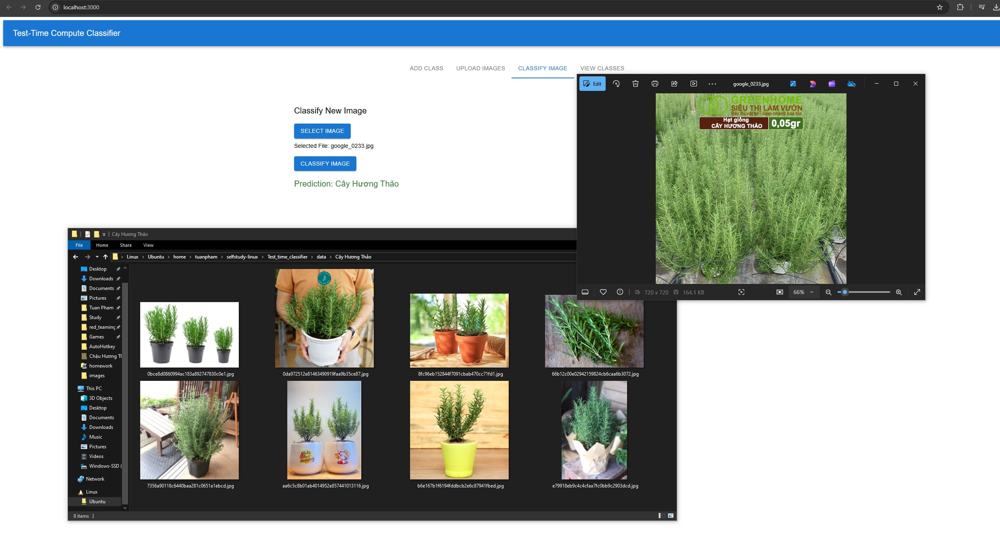

# Test time classifier

## Quickly make a classifier without any training by leveraging the god of high vector dimensionality.


  

## Given only 5 images of cats, we can predict new images of cats with high accuracy. The same goes for rosemary.

  

## We can combined with multiple Faiss indexes from different models and construct a more robust k-NN classifier.


## Installation
```bash
pip install -r requirements.txt
cd frontend && npm install && cd ..
```

## Usage
### Start the react frontend
```bash
npm start
```

### Start the API server
```bash
python scripts/start_api_server.py
```


