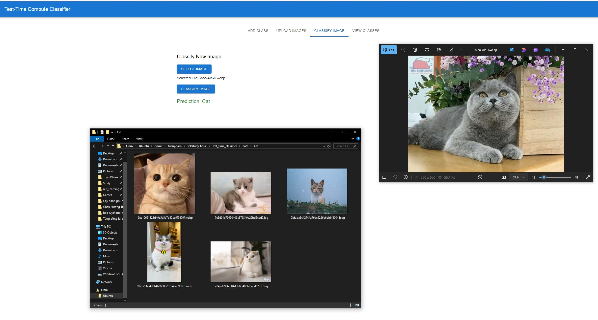
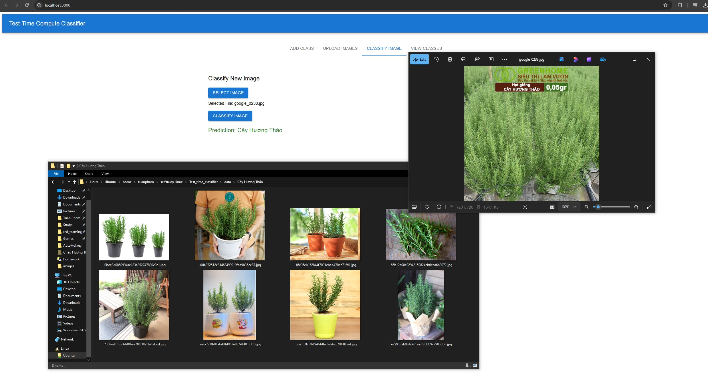

# Test time classifier

## Quickly make a classifier without any training by leveraging the god of high vector dimensionality.


  

## Given only 5 images of cats, we can predict new images of cats with high accuracy. The same goes for rosemary.

  

## We can combined with multiple Faiss indexes from different models and construct a more robust k-NN classifier.

This project now supports both image and text classification. Text inputs are embedded using
pretrained [Sentence Transformers](https://www.sbert.net/). Select the appropriate
`FEATURE_MODEL` and `DATA_LOADER` in your environment to switch between modalities.

> **Note:** You must use a feature extractor with general training objective like imagenet or COCO.
>
> Only use domain specific if the new classes added to the index are in the same domain. 


## Installation
```bash
pip install -r requirements.txt
cd frontend && npm install && cd ..
```

## Usage
### Start the react frontend
```bash
npm start
```

### Start the API server
```bash
python scripts/start_api_server.py
```

### Example API calls

- Upload text samples:
  `POST /upload_texts`
- Classify a text string:
  `POST /classify_text`


### UI Updates
The React frontend now includes tabs for uploading text samples and classifying arbitrary text inputs. Start the frontend with `npm start` and navigate through the new **Upload Texts** and **Classify Text** tabs to interact with the language classifier.
